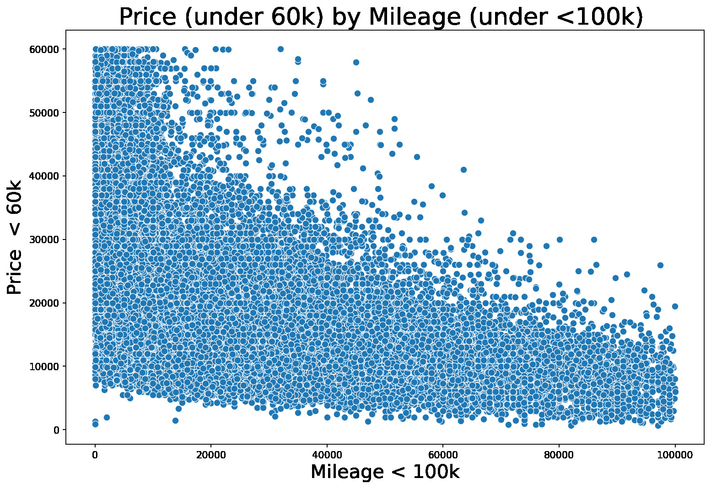
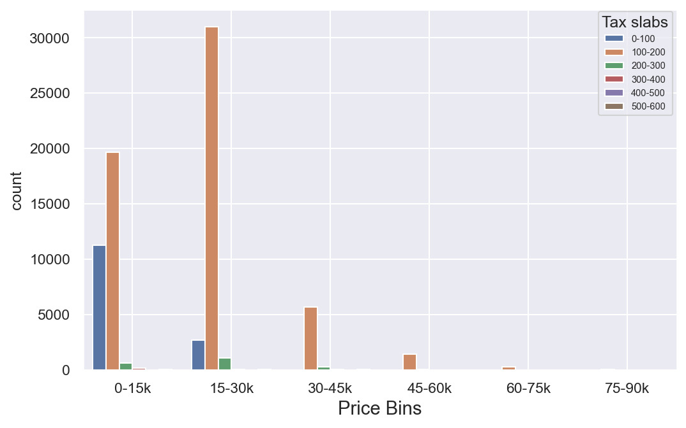
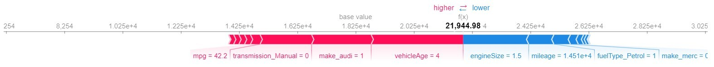
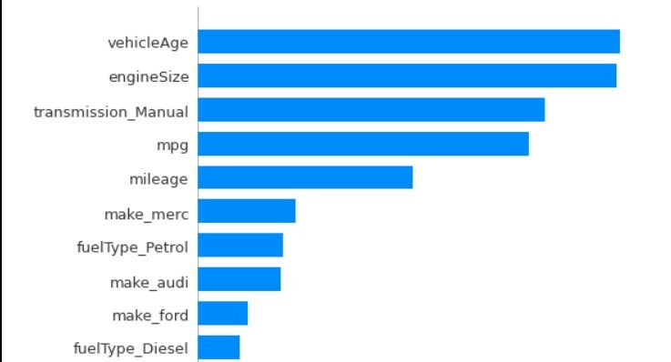

# Car Pricing - UK
A ML project to analyse and predict the used car prices in the UK. The data set can be found [here](https://www.kaggle.com/datasets/adityadesai13/used-car-dataset-ford-and-mercedes?select=hyundi.csv). There are separate csv files for each manufacturer, I have taken 6 different csv files with different manufacturers and merged them to yield a huge dataset of approx. 80k instances and created a column to determine which model belongs to which manufacturer (make). 

If a separate data for each manufacturer is needed you can download it from the above link or through the *inputs* folder above and filter out the required manufacturers.

## Folder Structure
**UK_Used_Car_Pricing**  
 ┣ .ipynb_checkpoints  
 ┣ images  
 ┣ inputs  
 ┃ ┗ UK_used_cars.csv  
 ┣ models  
 ┃ ┣ xgb_scaled_None.bin  
 ┃ ┗ xgb_scaled_True.bin  
 ┣ notebooks  
 ┃ ┣ .ipynb_checkpoints  
 ┃ ┣ EDA.ipynb  
 ┃ ┗ Regression Modelling.ipynb  
 ┣ src  
 ┃ ┣ __pycache__  
 ┃ ┣ config.py  
 ┃ ┣ model_dispatcher.py  
 ┃ ┗ train.py  
 ┣ .gitattributes  
 ┣ .gitignore  
 ┗ README.md  

 **Folders** 
 *images* - contains all the images of the visualizations used in readme.
 *inputs* - contains all the input files used in the project.
 *models* - contains the .bin files of the different models developed.
 *notebooks* - contains .ipynb notebooks for EDA and model evaluations.
 *src* - contains .py executable files to build the required models. model_dispatcher.py hass all the models in it.
 
 ## EDA
 
 **Analysis - Mileage**    

- The lower the mileage, the more the price of the used car.
- If the mileage is <50000, the price can rise as much as >£60k.
 
 

**Analysis - Year**   

 - Recently brought cars have a higher price range than the older cars.
 - The price of the cars with model year less than 5 years costs twice the price compared to cars that are purchased more than 5 years ago.
 
 

**Analysis - Transmission**  

 - Automatic and semi automatic car prices are more as compared to manual cars. 
 - Most of the manual transmission cars' price range lies between £0-£30k where as the price range for automatic and semi-automatic cars is £0-£45k.
 - More automatic and semi-automatic cars are sold more than £30k
 
 

**Analysis - Fuel Type**  

 - Diesel cars have more price than the petrol cars. 
 - Most diesel car prices range from £15-£30k where as most petrol cars are sold in the price between £0-£15k.
 - Where as hybrid cars, majority of them fall between £15-£30k, not more than that.
 
 

**Analysis - Tax**  

 - Most of the cars sold in the range £15-£30k have a tax slab of 100-200 units. 
 - Most of the cars priced between £0-£15k have a tax ranging between 0-200.
 
 

**Analysis - MPG**  

- Most of the cars sold in the range £15-£30k have a tax slab of 100-200 units. 
- Most of the cars priced between £0-£15k have a tax ranging between 0-200.

**Analysis - Engine Size**  

- Audi, BMW and Mercedes cars with engine size between 1.5L to 2L and with similar MPG as other manufacturers cost at least £10000 higher. 

## Modeling and Results
**Data Cleaning and Feature Engineering** 
- Dropped 'model' feature since it had no relevance.
- Created a 'vehicleAge' feature from 'year' to reduce its multi-collinearity.
- One Hot encoded 'make','transmission', 'fuelType' columns since they were a categorical features.

**Modelling - Machine Learning** 
- Developed various regression models like linear regression, OLS, ridge, and XGBoost regressor.
- The best model was the XGBoost regressor with R-squared value of 0.94 on the test set. Mean Absolute Error of 1510 on the same test set. This means that the predicted value could be more or less than 1510, so the pricing could be done in that range.

**Modelling - Deep Learning** 
- I have also built a single hidden layer neural network model to predict the car prices.
- The output of the first layer (input layer) is a 32-D array with a 'ReLU' activation since prices cannot be nagative. The output of the hidden layer is also set to 32-D and the output of the last layer is a single value as we want to predict one value for each instance. The output has no activation since our prediction must be linear.
- I have given a code to run the DL model for many epochs, using various output dimensions. Due to the amount of data and lack of GPU processors I have not run these as they take more than 1 hr and are crashing even in colab.

**SHAP - XGBoost model** 

 

- SHAP force plot (above) and Summary Plot (left).
- f(x) is the model prediction. Features pushing the prediction higher than the base value are shown in red, those pushing the prediction lower are in blue
- The mean prediction across the full test dataset serves as the basis value. It is the value that would be projected if the current output had no features.
- Features are ordered in descending order by feature importance. Features with high predicting power are shown at the top and the ones with low predicting powers are shown at the bottom.(left plot)
 
 

**Key takeaways from model from business perspective:**
- The company should focus on features like 'vehicleAge', 'make', 'Transmission type', and 'mpg as these are the ones that push the prediction towards higher side yeilding a higher price.
- 'vehicleAge', 'engineSize', 'Transmission type', 'mileage', 'make', 'mpg', etc are among the top features for the prediction model, re-evaluating these could be a best way to set pricing for the used cars.
